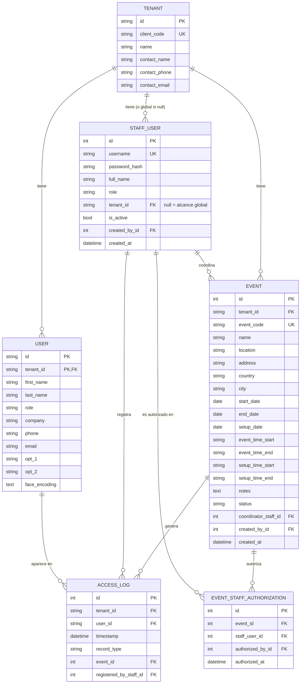

# Modelo de Datos — GoldenWeb 2.0

> Estado real tomado de `app/models.py` en la rama `feature/auth-roles-events`
> (no mergeada a `main` todavía). Esta es la fuente de verdad técnica — si
> este documento y el código difieren, manda el código y hay que actualizar
> esto.

## 1. Modelo actual



### Notas de diseño ya tomadas (no reabrir sin razón)

- **`User` ≠ `StaffUser`.** `User` es la persona biométrica (asistente/empleado
  del cliente); `StaffUser` es la cuenta de alguien de Golden operando el
  sistema. Es una fuente de confusión frecuente al leer el código — no son
  la misma tabla ni tienen relación directa entre sí.
- **`User` es por-tenant, no por-evento.** El rostro/registro de una persona
  se guarda a nivel de tenant (cliente de Golden), y `AccessLog.event_id`
  es lo que ata una acción de registro a un evento puntual. Esto tiene una
  implicación para el Épico 1 del backlog (registro por cédula): "cargar la
  base del evento" probablemente signifique crear/actualizar filas de `User`
  para ese tenant, no una tabla nueva de "asistentes esperados" — a
  confirmar con la sesión de código antes de implementar, porque cambia
  cómo se relaciona un Excel cargado con `status = "No registrado"`.
- **`status` de `Event`** vive en tres valores (`creado`/`en_proceso`/
  `finalizado`), navegable libremente entre los tres, no es un flujo
  unidireccional.
- **`EventStaffAuthorization`** es sobre *acceso al sistema* (quién puede
  operar el kiosko de un evento), no sobre *asignación de personal* para
  facturación (Épico 7) — son conceptos distintos aunque suenen parecido;
  ver más abajo `EventStaffAssignment` propuesta.

## 2. Extensiones conceptuales por módulo nuevo

Estas tablas **no existen todavía** — es la primera aproximación para
planear, no el diseño final (eso lo cierra quien lo implemente). Se anota
igual para que al refinar cada épico del backlog haya un punto de partida.

### Épico 2 — Escarapelas

```
BadgeTemplate(id, tenant_id, event_id nullable, name, background_image_path,
              fields_json [lista de {campo, x, y, fuente, tamaño, color}],
              created_at)
```
`event_id` nullable a propósito: una plantilla puede ser reusable entre
eventos de un mismo cliente, o específica de uno.

### Épico 5 — Formularios web

```
FormDefinition(id, tenant_id, event_id nullable, title, theme_json,
               fields_json, created_at)
FormSubmission(id, form_id, submitted_at, data_json, ip_address)
FormAttachment(id, submission_id, filename, storage_path, content_type)
```
`FormSubmission.data_json` alimenta directo la creación/actualización de
`User` para el tenant/evento correspondiente (mismo punto de diseño que la
nota sobre carga de Excel arriba — conviene resolver ambos a la vez, son el
mismo problema: "cómo entra gente a la base del evento").

### Épico 7 — Personal y facturación

```
EventStaffAssignment(id, event_id, staff_user_id, rol_en_evento, tarifa,
                      horas_trabajadas, facturado bool)
Invoice(id, event_id, numero_factura, monto, estado, emitida_at)
```
Deliberadamente separada de `EventStaffAuthorization` (esa es sobre acceso
al sistema; esta es sobre nómina/facturación — alguien puede estar asignado
para cobrar sin necesitar cuenta de acceso, o viceversa).

### Épico 8 — Pagos

```
Payment(id, tenant_id, event_id nullable, form_submission_id nullable,
        proveedor, monto, moneda, estado, referencia_externa, created_at)
```
Bloqueada por la pregunta abierta de qué proveedor reemplaza a PayU (ver
`REQUERIMIENTOS_ROADMAP.md` §5).

### Épico 9 — Acta de novedades

```
EventReportAttachment(id, event_id, filename, encrypted_blob o storage_path,
                       content_type, uploaded_by_staff_id, uploaded_at)
EventSignature(id, event_id, signer_name, signature_image, signed_at)
```
Esto ya está anotado como el siguiente push pendiente en la rama actual de
código ("archivos adjuntos por evento, cifrados") — cuando se implemente,
actualizar esta sección para que quede el diseño real, no el propuesto.

### Épico 6 — Portal de cliente / encuesta

```
Survey(id, event_id, questions_json)
SurveyResponse(id, survey_id, respondent_user_id nullable, answers_json,
               submitted_at)
```

## 3. Preguntas de modelado a resolver antes de construir (no después)

1. ¿"Cargar el Excel del evento" crea filas de `User` (tenant-scoped, como
   hoy) o necesita una tabla intermedia `EventAttendee` para distinguir
   "esperado en este evento" de "conocido para este tenant en general"? Esto
   determina cómo se ve `status = "No registrado"` para alguien que nunca
   asistió a nada antes.
2. ¿Las plantillas de escarapela y de formulario son por tenant, por evento,
   o ambas (con herencia/override)? Afecta si `event_id` es obligatorio o
   nullable en `BadgeTemplate`/`FormDefinition`.
3. ¿Los archivos adjuntos (evento, formularios) van cifrados en base de datos
   (como ya se decidió para el acta de novedades) o en almacenamiento de
   archivos con referencia en la base? Mantener consistencia entre módulos.
